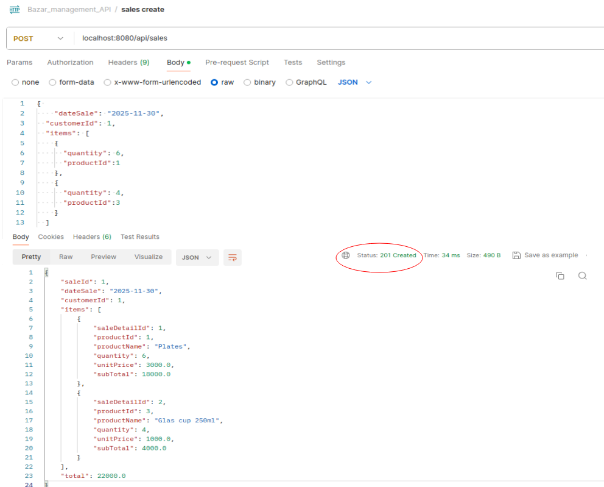

# 🏪 Bazar Management API

**Bazar Management System developed with Spring Boot**

> **Integrative Project** developed as part of the "API Development with Spring Boot" course from **TodoCode Academy**. The implementation and architectural design are completely original, oriented to demonstrate professional competencies in backend development with Java.

---

## 📋 **Project Description**

**Bazar Management** is a comple├── 📊 UML Bazar-Management API.png  # Complete system UML diagram
├── 📄 HELP.md                       # Spring Boot help guideREST API for bazar management, allowing administration of products, customers and sales. The system implements complete CRUD operations and advanced business functionalities, following Spring Boot development best practices.

### 🎯 **Purpose**

This project is part of my **professional portfolio** as a Java backend developer, demonstrating competencies in:

- Robust REST API development
- Layered architecture implementation
- Design patterns application
- Functional programming with Java 8+
- Professional exception handling

---

## 🚀 **Main Features**

### **👥 Customer Management**

- ✅ Complete CRUD operations for customers
- ✅ Mandatory field validations
- ✅ Unique DNI validation (with `existsByDni()` method)
- ✅ Search by ID with exception handling
- ✅ Intelligent partial updates

### **📦 Product Management**

- ✅ Complete CRUD operations for products
- ✅ Inventory control (stock)
- ✅ Low stock product queries (with `findByStockLessThanEqual()` method)
- ✅ Partial updates that preserve existing data

### **🛒 Sales Management**

- ✅ Multi-product sales creation
- ✅ Automatic available stock validation
- ✅ Automatic inventory updates
- ✅ Automatic calculation of subtotals and total
- ✅ Advanced queries (highest sale, summary by date)
- ✅ Get products from a specific sale

### **📊 System UML Diagram**

The project includes a **complete UML diagram** that shows the relationships between entities, DTOs and system architecture.

📄 **File**: [`UML Bazar-Management API.png`](./UML%20Bazar-Management%20API.png)

**Data Model - 4 main entities:**

- **👤 Customer**: Customer management (customerId, firstName, lastName, dni)
- **📦 Product**: Product management (productId, name, brand, unitPrice, stock)
- **🛒 Sale**: Sales management (saleId, dateSale, customerId, total)
- **🧾 SalesDetail**: Sale details (productId, quantity, unitPrice, subTotal)

**Main Relationships:**

- **Customer** `makes` **Sale** (1:N)
- **Product** `appears in` **SalesDetail** (1:N)
- **Sale** `contains` **SalesDetail** (1:N)
- **DTO ↔ Entity mapping** for all layers

> The diagram illustrates the complete architecture including JPA entities, DTOs, and relationships between all system components.

---

## 🏗️ **Architecture and Implemented Patterns**

### **MVC Architecture - Layers**

```
📦 Bazar-Management/
├── 🎮 Controller/     # Presentation layer (REST Controllers)
├── 💼 Service/        # Business logic layer
├── 🗃️ Repository/     # Data access layer (JPA)
├── 🏗️ Model/          # JPA Entities
├── 📦 DTO/            # Data Transfer Objects
└── 🔄 Mapper/         # Entity ↔ DTO Converters
```

### **Implemented Design Patterns**

- **🔄 DTO Pattern**: Secure data transfer between layers
- **📋 Repository Pattern**: Data access abstraction
- **🏭 Service Layer Pattern**: Business logic encapsulation
- **🗂️ Mapper Pattern**: Entity ↔ DTO conversion

### **Functional Programming**

- **λ Lambda Expressions**: For filtering and mapping operations
- **🌊 Stream API**: Collection processing
- **📎 Method References**: Cleaner and readable code

```java
// Ejemplo de programación funcional implementada
return saleRepo.findAll()
    .stream()
    .max(Comparator.comparingDouble(Sale::getTotal))
    .orElseThrow(() -> new ResponseStatusException(HttpStatus.NOT_FOUND, "No sales found"));
```

### **ResponseEntity for HTTP Responses**

All responses implement **ResponseEntity** for granular control of HTTP status codes:

```java
// Examples of structured responses
return ResponseEntity.ok(productDTO);                           // 200 OK
return ResponseEntity.created(location).body(productDTO);       // 201 Created
return ResponseEntity.notFound().build();                       // 404 Not Found
return ResponseEntity.badRequest().body("Error message");       // 400 Bad Request
return ResponseEntity.status(HttpStatus.CONFLICT)
    .body("DNI already exists");                                // 409 Conflict
return ResponseEntity.status(HttpStatus.INTERNAL_SERVER_ERROR)
    .body("Internal error");                                    // 500 Internal Server Error
```

---

## ️ **Technology Stack**

| Technology          | Version | Purpose                      |
| ------------------- | ------- | ---------------------------- |
| **Java**            | 17      | Programming language         |
| **Spring Boot**     | 3.x     | Main framework               |
| **Spring Data JPA** | -       | ORM and data access          |
| **H2 Database**     | -       | Main database (in-memory)    |
| **MySQL**           | 8.x     | Alternative database (XAMPP) |
| **Maven**           | -       | Dependency management        |
| **Lombok**          | -       | Boilerplate code reduction   |
| **Postman**         | -       | Endpoint testing             |

---

## **API Endpoints**

**Base URL**: `http://localhost:8080/api`

### **👥 Customers**

```http
GET    /customers           # List all customers
POST   /customers           # Create new customer
GET    /customers/{id}      # Get customer by ID
PUT    /customers/{id}      # Update customer (partial)
DELETE /customers/{id}      # Delete customer
```

### **📦 Products**

```http
GET    /products            # List all products
POST   /products            # Create new product
GET    /products/{id}       # Get product by ID
PUT    /products/{id}       # Update product (partial)
DELETE /products/{id}       # Delete product
GET    /products/low-stock  # Products with low stock (≤ 5)
```

### **🛒 Sales**

```http
GET    /sales               # List all sales
POST   /sales               # Create new sale
GET    /sales/{id}          # Get sale by ID
PUT    /sales/{id}          # Update sale (customer and date only)
DELETE /sales/{id}          # Delete sale
GET    /sales/products/{id} # Products from a specific sale
GET    /sales/date/{date}   # Sales summary by date
GET    /sales/greatest-total-amount    # Sale with highest amount
```

---

## 💡 **Usage Examples**

### **Create a Product**

```json
POST /api/products
Content-Type: application/json

{
    "name": "Transparent glass cup 250ml",
    "brand": "Luminarc",
    "unitPrice": 8.50,
    "stock": 24
}

Response: 201 Created
{
    "productId": 1,
    "name": "Transparent glass cup 250ml",
    "brand": "Luminarc",
    "unitPrice": 8.50,
    "stock": 24
}
```

### **Create a Sale**

```json
POST /api/sales
Content-Type: application/json

{
    "dateSale": "2025-12-27",
    "customerId": 1,
    "items": [
        {
            "productId": 1,
            "quantity": 4
        },
        {
            "productId": 2,
            "quantity": 1
        }
    ]
}

Response: 201 Created
{
    "saleId": 1,
    "dateSale": "2025-12-27",
    "customerId": 1,
    "total": 59.00,
    "items": [
        {
            "saleDetailId": 1,
            "productId": 1,
            "productName": "Transparent glass cup 250ml",
            "quantity": 4,
            "unitPrice": 8.50,
            "subTotal": 34.00
        },
        {
            "saleDetailId": 2,
            "productId": 2,
            "productName": "Deep plate 22cm",
            "quantity": 1,
            "unitPrice": 25.00,
            "subTotal": 25.00
        }
    ]
}
```

### **📸 Visual Example - Postman Interface**



*Complete example showing the POST /api/sales request and **201 Created** response in Postman interface, demonstrating the multi-product sale creation with automatic calculations and proper HTTP status codes.*

> ✨ **Note**: For more detailed examples, check the **Postman collection** included in the project.

### **Special Queries**

#### **Low Stock Products**

```http
GET /api/products/low-stock

Response: 200 OK
[
    {
        "productId": 3,
        "name": "Cutlery set 24pcs",
        "brand": "Tramontina",
        "unitPrice": 45.00,
        "stock": 2
    }
]
```

---

## ⚡ **Outstanding Technical Features**

### **🔒 Robust Validations**

The system implements exhaustive validations across all layers:

- ✅ **Mandatory fields**: Null data and empty string verification
- ✅ **Data uniqueness**: Prevention of duplicate DNI and existing resources
- ✅ **Business rules**: Validation of negative values, insufficient stock
- ✅ **Temporal integrity**: Future date verification and data consistency
- ✅ **Appropriate HTTP codes**: 400 Bad Request, 409 Conflict, 404 Not Found

### **🗃️ Data Integrity and Cascade Operations**

The system implements **cascade operations** to maintain referential integrity:

- ✅ **CascadeType.ALL**: Sale operations automatically affect their details
- ✅ **Orphaned record prevention**: When deleting a sale, all associated SalesDetail are deleted
- ✅ **Referential integrity**: Guarantees consistency between related entities
- ✅ **Automatic transactions**: Atomic operations to maintain data coherence

### **🛡️ Professional Exception Handling**

The system implements robust error handling with **ResponseStatusException** and semantic HTTP codes:

```java
// Example of custom exception handling
Customer customer = customerRepo.findById(id)
    .orElseThrow(() -> new ResponseStatusException(
        HttpStatus.NOT_FOUND,
        "Customer not found"
    ));
```

## 🚀 **Installation and Execution**

### **Prerrequisitos**

- ☕ Java 17 o superior
- 📦 Maven 3.6+
- � Usa H2 Database (incluida) para pruebas inmediatas. Listo para ejecutar.
- �🗄️ MySQL + XAMPP (opcional, para desarrollo local)

### **Configuration**

1. **Clone the repository**

```bash
git clone https://github.com/CamilaVHeuer/Bazar-Management-API.git
cd Bazar-Management-API
```

2. **Database configuration**

**🚀 Default configuration (H2 Database):**

> The application comes **preconfigured** to run with H2. You just need to clone and run!

```properties
# application.properties (already configured)
spring.application.name=BazarManagement

# DATASOURCE (H2) - In-memory database
spring.datasource.url=jdbc:h2:mem:bazar_management;MODE=MySQL;DB_CLOSE_DELAY=-1;
spring.datasource.driverClassName=org.h2.Driver
spring.datasource.username=tu_user
spring.datasource.password=tu_password

# JPA / HIBERNATE
spring.jpa.hibernate.ddl-auto=update
spring.jpa.show-sql=true
spring.jpa.properties.hibernate.format_sql=true
spring.jpa.database-platform=org.hibernate.dialect.H2Dialect

# H2 CONSOLE
spring.h2.console.enabled=true
spring.h2.console.path=/h2-console
```

**🗄️ Alternative: MySQL with XAMPP (for local development):**

If you prefer to use MySQL with XAMPP, replace the `application.properties`:

```properties
# application.properties
spring.application.name=BazarManagement
server.port=8080

# DATASOURCE (MySQL + XAMPP)
spring.datasource.url=jdbc:mysql://localhost:3306/bazar_management?useSSL=false&serverTimezone=UTC
spring.datasource.username=tu_user
spring.datasource.password=tu_password

# JPA / HIBERNATE
spring.jpa.hibernate.ddl-auto=update
spring.jpa.show-sql=true
```

3. **Run the application**

```bash
# Compile the project
mvn clean compile

# Run the application
mvn spring-boot:run
```

4. **Access the services**

- **API Base**: `http://localhost:8080/api`
- **H2 Console** (if enabled): `http://localhost:8080/h2-console`

---

## 🧪 **Testing**

### **Postman Collection**

The project includes a Postman collection with:

- ✅ All endpoints for Customers, Products and Sales
- ✅ Request examples with test data
- ✅ Requests for all HTTP methods (GET, POST, PUT, DELETE)

**To import the collection:**

1. Open Postman
2. Click on "Import"
3. Navigate to the project's `postman/` folder
4. Select the `Bazar-Management-API.postman_collection.json` file

> 📝 **Note**: The collection contains all necessary requests to test the complete API functionality.

## 🔧 **Project Structure**

### **General Structure**

```
Bazar-Management/
├── 📄 README.md                     # Main project documentation
├── 📊 UML Bazar-Management API.png  # Complete system UML diagram
├── � POST-Sales-Example.png        # Postman POST /api/sales example
├── �📄 HELP.md                       # Spring Boot help guide
├── 📄 pom.xml                       # Maven configuration and dependencies
├── 📁 postman/                      # Postman collection for testing
│   ├── Bazar-Management-API.postman_collection.json
│   └── POST-Sales-Example.png       # Visual example of POST /api/sales
├── 📁 src/main/java/com/camicompany/BazarManagement/
│   ├── 📁 controller/               # REST endpoints
│   │   ├── CustomerController.java  # Customer endpoints
│   │   ├── ProductController.java   # Product endpoints
│   │   └── SaleController.java      # Sales endpoints
│   ├── 📁 dto/                      # Data Transfer Objects
│   │   ├── CustomerDTO.java         # Customer DTO
│   │   ├── ProductDTO.java          # Product DTO
│   │   ├── SaleDTO.java             # Sale DTO
│   │   ├── SalesDetailDTO.java      # Sales detail DTO
│   │   └── SalesSummaryDTO.java     # Sales summary DTO
│   ├── 📁 mapper/
│   │   └── Mapper.java              # Entity ↔ DTO conversions
│   ├── 📁 model/                    # JPA Entities
│   │   ├── Customer.java            # Customer entity
│   │   ├── Product.java             # Product entity
│   │   ├── Sale.java                # Sale entity
│   │   └── SalesDetail.java         # Sales detail entity
│   ├── 📁 repository/               # Data access layer
│   │   ├── ICustomerRepository.java # Customer repository
│   │   ├── IProductRepository.java  # Product repository
│   │   └── ISaleRepository.java     # Sales repository
│   ├── 📁 service/                  # Business logic layer
│   │   ├── ICustomerService.java    # Customer service interface
│   │   ├── CustomerService.java     # Customer service implementation
│   │   ├── IProductService.java     # Product service interface
│   │   ├── ProductService.java      # Product service implementation
│   │   ├── ISaleService.java        # Sales service interface
│   │   └── SaleService.java         # Sales service implementation
│   └── BazarManagementApplication.java # Main Spring Boot class
├── 📁 src/main/resources/
│   ├── application.properties       # Application configuration
│   ├── 📁 static/                   # Static resources
│   └── 📁 templates/                # Templates (if any)
└── 📁 src/test/java/               # Unit tests
    └── com/camicompany/BazarManagement/
        └── BazarManagementApplicationTests.java
```

## 🎯 **Demonstrated Technical Competencies**

### **Backend Development**

- ✅ Complete REST API development
- ✅ Layered architecture implementation (MVC)
- ✅ Complex JPA relationship handling
- ✅ Design pattern implementation

### **Spring Framework**

- ✅ Spring Boot for auto-configuration
- ✅ Spring Data JPA for persistence
- ✅ Spring Web for REST controllers
- ✅ Dependency Injection with @Autowired

### **Modern Java**

- ✅ Functional programming (Streams, Lambda, Method References)
- ✅ Optional for safe null handling
- ✅ Lombok for boilerplate reduction
- ✅ Date handling with LocalDate

### **Databases**

- ✅ Relational schema design
- ✅ 1:N relationship implementation
- ✅ JPA derived queries
- ✅ Custom repository methods (`existsByDni`, `findByStockLessThanEqual`)
- ✅ Automatic transactions

### **Best Practices**

- ✅ Separation of Concerns
- ✅ Defensive Programming
- ✅ Clean Code principles
- ✅ RESTful API design
- ✅ Proper error handling

---

## 🛡️ **Error Handling**

The system implements robust error handling with appropriate HTTP codes:

### **Implemented Status Codes**

| Code    | Description           | Example                        |
| ------- | --------------------- | ------------------------------ |
| **200** | OK                    | Successful operation           |
| **201** | Created               | Entity created correctly       |
| **400** | Bad Request           | Invalid data, negative values  |
| **404** | Not Found             | Entity not found               |
| **409** | Conflict              | Duplicate DNI, resource exists |
| **500** | Internal Server Error | System error                   |

## ‍💻 **Developed by**

**Camila V. Heuer**

- 📧 Email: [camila.vheuer@email.com]
- 💼 LinkedIn: [linkedin.com/in/camila-vheuer]
- 🐙 GitHub: [github.com/CamilaVHeuer]

---

## 🎓 **Academic Context**

This project was developed as an **Integrative Project** for the course:

- **Course**: API Development with Spring Boot
- **Academy**: TodoCode Academy
- **Year**: 2025

**Note**: Although the assignment was provided by the academy, all implementation, architectural design and technical decisions were developed completely independently.
